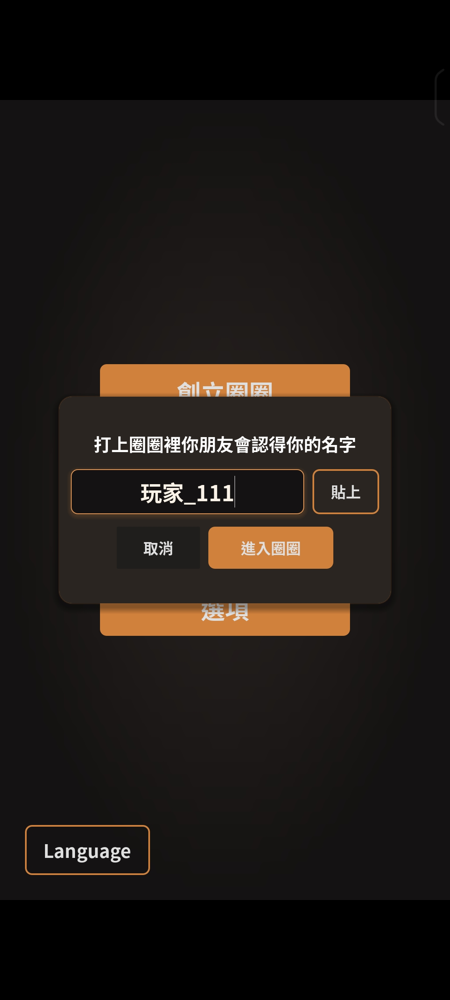
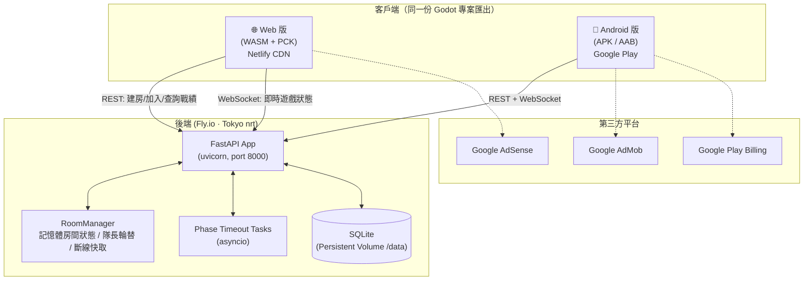
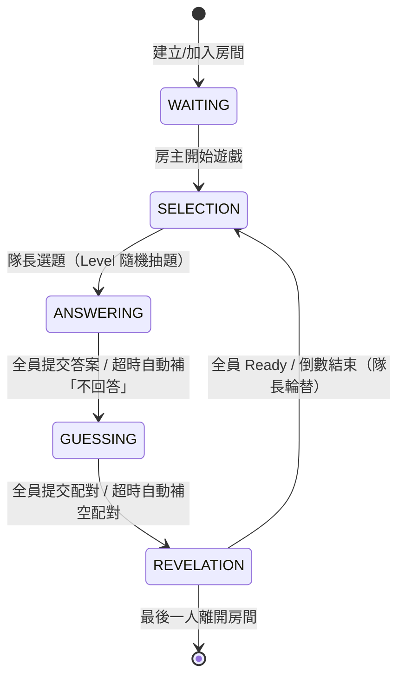
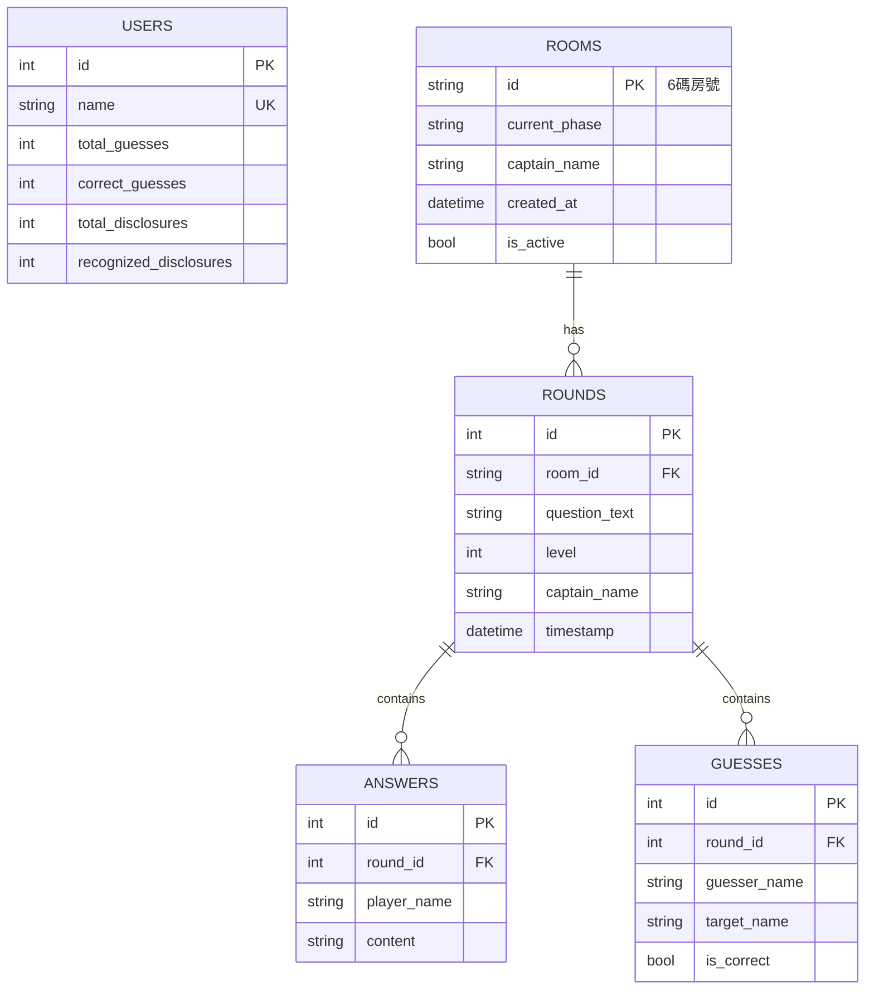

# Friends & Me — 異步社交探索桌遊（專案說明書 / Portfolio）

> 一款基於**喬哈里視窗（Johari Window）**心理學理論設計的多人連線社交桌遊。玩家透過「答題 → 猜測他人答案 → 結果揭曉」的循環，核對「他人眼中的自己」與「真實自我」之間的落差，在低社交壓力下促進朋友間的深度連結與自我探索。

| 項目 | 內容 |
|---|---|
| **專案類型** | 跨平台多人即時連線遊戲（Web + Android）|
| **開發角色** | 獨立開發（全端：遊戲前端、後端伺服器、DevOps 部署、上架營運）|
| **遊戲引擎** | Godot Engine 4.6（GDScript）|
| **後端** | Python · FastAPI · WebSockets · SQLAlchemy（async）· SQLite |
| **部署平台** | 後端 Fly.io（Docker + Persistent Volume）；Web 前端 Netlify / CrazyGames；Android 上架 Google Play |
| **線上 Demo** | Web 版：`https://friendandme.netlify.app` ｜ 後端：`https://friends-and-me.fly.dev` |
| **原始碼** | https://github.com/hank92312/Friend-Me |
| **變現整合** | Google AdMob（行動端廣告）、Google AdSense（Web 端）、Google Play Billing（內購）|

---

## 畫面展示（Visuals）

### 品牌主視覺
<p align="center">
  
</p>

<table>
  <tr>
    <td align="center"><br><sub>App Logo<br>（五人 × 喬哈里視窗意象）</sub></td>
    <td align="center"><br><sub>商店封面（直式）</sub></td>
  </tr>
</table>

### 入口與多語系

<table>
  <tr>
    <td align="center"><br><sub>主選單（建立／加入圈圈）</sub></td>
    <td align="center"><br><sub>多語系切換（中／英即時切換）</sub></td>
    <td align="center"><br><sub>輸入暱稱進入圈圈</sub></td>
  </tr>
</table>

### 核心遊戲循環（Phase 1 → 4）

<table>
  <tr>
    <td align="center"><br><sub>Phase 1：隊長選題<br>（五層社交深度）</sub></td>
    <td align="center"><br><sub>Phase 2：答題<br>（可選「不回答」）</sub></td>
    <td align="center"><br><sub>Phase 3：配對猜題<br>（答案 ↔ 玩家連線）</sub></td>
    <td align="center"><br><sub>Phase 4：結果揭曉<br>（單輪猜對／被猜中）</sub></td>
  </tr>
</table>

### 數據回饋（喬哈里視窗的量化）

<table>
  <tr>
    <td align="center"><br><sub>個人結算：累計猜中率、被猜中次數、<br>「最了解你的人」默契排行榜</sub></td>
  </tr>
</table>

---

## 目錄
1. [產品定位與核心機制](#1-產品定位與核心機制)
2. [系統架構總覽](#2-系統架構總覽)
3. [技術棧](#3-技術棧)
4. [遊戲流程狀態機](#4-遊戲流程狀態機)
5. [前端設計（Godot）](#5-前端設計godot)
6. [後端設計（FastAPI）](#6-後端設計fastapi)
7. [資料庫模型](#7-資料庫模型)
8. [即時通訊協定（WebSocket）](#8-即時通訊協定websocket)
9. [部署與第三方平台串接](#9-部署與第三方平台串接)
10. [建置自動化 Pipeline](#10-建置自動化-pipeline)
11. [關鍵工程挑戰與解法](#11-關鍵工程挑戰與解法)
12. [多語系（i18n）](#12-多語系i18n)
13. [安全性實踐](#13-安全性實踐)
14. [專案結構](#14-專案結構)
15. [面試重點摘要（Talking Points）](#15-面試重點摘要talking-points)

---

## 1. 產品定位與核心機制

### 設計理念
利用「**異步遊戲**」降低面對面社交的即時壓力，透過「**自我揭露**」與「**社交驗證**」促進深度連結。

### 心理學機制
- **喬哈里視窗實踐**：透過「猜測他人答案」這個動作，讓玩家具體核對「別人眼中的我」與「真實的我」之間的差距。
- **心理安全設計**：
  - 「**不回答**」本身就是一個合法選項，降低被強迫揭露的焦慮，同時也作為猜測階段的干擾項。
  - **數據隱私可控**：玩家可自由設定「被猜中率」與「猜中率」要公開或私有。
- **五層社交深度（話題等級）**：

| 等級 | 主題 | 範例情境 |
|---|---|---|
| Level 1 | 閒話家常 | 日常習慣 |
| Level 2 | 下午茶閒聊 | 輕鬆話題 |
| Level 3 | 居酒屋微醺 | 感情與生活抱怨 |
| Level 4 | 深夜真心話 | 夜深人靜的秘密 |
| Level 5 | 靈魂拷問 | 挑戰底線的極端情境 |

> 題庫共 **156 題**（L1–L3 各 35 題、L4 26 題、L5 25 題），以台灣在地文化為主題（夜市、手搖飲、颱風假、KTV、圍爐、親戚聚會等），全為開放式單一答案題型，並提供中／英雙語。

---

## 2. 系統架構總覽



**核心架構特點：**
- **單一程式碼庫（single codebase）多平台輸出**：同一份 Godot 專案同時匯出 Web（WASM）與 Android（AAB），網路層、UI、遊戲邏輯完全共用。
- **權威伺服器（authoritative server）**：所有階段推進與計分由後端決定並廣播，前端僅負責呈現與輸入，避免作弊與狀態分歧。
- **記憶體即時狀態 + 資料庫持久化分離**：高頻的房間即時狀態存於記憶體（`RoomManager`），低頻的累計戰績與歷史紀錄寫入 SQLite。

---

## 3. 技術棧

| 層級 | 技術 | 用途 |
|---|---|---|
| **遊戲引擎** | Godot Engine 4.6 / GDScript | 跨平台 UI、遊戲邏輯、動畫 |
| **渲染** | GL Compatibility（OpenGL ES / WebGL）| 兼顧低階行動裝置與瀏覽器 |
| **後端框架** | FastAPI 0.110 | REST API + WebSocket 端點 |
| **ASGI Server** | uvicorn 0.27 | 非同步伺服器 |
| **即時通訊** | websockets 12.0 | 雙向即時狀態廣播 |
| **ORM** | SQLAlchemy（async）+ aiosqlite | 非同步資料庫存取 |
| **資料庫** | SQLite | 玩家戰績、房間、輪次、答案、猜測持久化 |
| **非同步排程** | asyncio Task | 階段超時自動推進、倒數計時 |
| **容器化** | Docker（python:3.10-slim）| 後端打包部署 |
| **後端託管** | Fly.io（含 Persistent Volume）| 全球邊緣部署、資料持久化 |
| **Web 託管** | Netlify（CDN + `_headers` 快取策略）| 靜態 WASM/PCK 派送 |
| **行動上架** | Google Play（AAB + Keystore 簽章）| Android 發行 |
| **變現** | AdMob / AdSense / Google Play Billing | 廣告與內購 |
| **推播** | NotificationScheduler 外掛 | 本地排程通知 |
| **建置工具** | 自製 Python 腳本（`build_and_patch.py` 等）| Web 匯出後處理與自動化 |

---

## 4. 遊戲流程狀態機



| Phase | 名稱 | 說明 | 計時 |
|---|---|---|---|
| 0 | Lobby & Waiting | 等待大廳，房主可輪流派任隊長 | — |
| 1 | Question Selection | 隊長選擇 Level 隨機抽題 | 60s |
| 2 | Answering | 玩家輸入答案或選「不回答」 | 120s |
| 3 | Guessing | 點擊答案 Pill 再點玩家完成連線配對 | 60s |
| 4 | Revelation | 動態揭曉配對結果、結算單輪與累計數據 | 120s |

> **每個階段都有伺服器端 `asyncio` 超時任務**：若玩家逾時未操作，後端自動補預設行為（自動選題 / 補「不回答」/ 補空配對）並廣播推進，確保遊戲不會因單一玩家卡住。

---

## 5. 前端設計（Godot）

### 視覺與互動
- **解析度**：設計尺寸 `1080×1920`（直式），開發預覽 `540×960`，採 `canvas_items` + `expand` 自適應拉伸。
- **視覺風格**：深色背景（`#1F1C1A`）+ 金橘色按鈕（`#D0813C`）+ 淡黃色副標（`#FFF2CC`），搭配 `GradientTexture2D` 放射漸層背景。
- **微互動動畫**：全域遞迴註冊按鈕 Hover（放大 1.04×）與 Press（縮小 0.94×）的 Tween 動畫；Phase 切換時平行執行舊畫面淡出縮小（0.18s）與新畫面淡入放大（0.22s），帶 `Cubic` 緩動。

### 模組化單例（Autoload）
| 單例 | 職責 |
|---|---|
| `NetworkManager` | 封裝 WebSocket / HTTP 通訊、重連狀態機（最多 8 次重試）|
| `AudioManager` | 全域音效播放、淡入淡出、動態音高控制 |
| `AdManager` | AdMob 廣告載入與展示 |
| `NotifManager` | 本地排程通知 |

### 核心檔案
- `main.tscn` / `main.gd`：Phase 0–4 的 UI 佈局、主遊戲循環、倒數、動畫
- `network_manager.gd`：通訊單例（含環境切換 LOCAL/CLOUD 旗標）
- `translation_data.gd`：中英文翻譯字典與動態折行策略
- `audio_manager.gd`：音效系統

---

## 6. 後端設計（FastAPI）

### REST API
| Method | Endpoint | 用途 |
|---|---|---|
| POST | `/create_room` | 產生 6 碼房號並預註冊房間 |
| POST | `/join_room` | 驗證房號存在性並加入 |
| GET | `/check_room/{room_id}` | 查詢房間是否存在 |
| GET | `/player/{name}/stats` | 查詢玩家累計戰績 |
| WS | `/ws/{room_id}/{player_name}` | 即時遊戲互動主通道 |

### 設計要點
- **`lifespan` 啟動鉤子**：啟動時自動建表（`init_db`）並載入本地題庫 JSON（供超時自動選題用）。
- **`RoomManager`（記憶體狀態機）**：管理房間狀態、隊長輪替、玩家清單、答案/猜測快取、斷線重連快取，並在最後一人離開時自動清理房間資源。
- **雙重超時保護**：
  - `phase_timeout_tasks`：每階段獨立的 `asyncio` 超時任務。
  - `countdown_tasks`：Revelation 階段「最後一人未 Ready」時啟動 10 秒倒數強制推進。
- **斷線後階段重檢**：玩家斷線後重新評估當前階段是否因人數減少而可推進（`_check_phase_progress_after_disconnect`），避免其他人卡在等待。

---

## 7. 資料庫模型



- **`users`**：跨房間、跨場次的累計戰績（猜中率、被猜中率）來源。
- **`rooms / rounds / answers / guesses`**：完整保留每一輪的題目、答案與配對結果，可供日後數據分析。

---

## 8. 即時通訊協定（WebSocket）

採事件驅動（event-based）JSON 協定，分為「客戶端 → 伺服器」與「伺服器廣播」兩類。

**客戶端送出事件：**
`start_game`、`topic_selected`、`answer_submitted`、`guesses_submitted`、`ready_for_next_round`、`leave_room`

**伺服器廣播事件：**
`phase_changed`、`player_list_updated`、`player_submitted_status`、`next_round_status`、`next_round_countdown`、`reconnect_status`

**關鍵防護 — 伺服器端階段守衛（Phase Guard）：**
`topic_selected` / `answer_submitted` / `guesses_submitted` 三個事件各加一道守衛——若事件對應階段與當前房間階段不符，一律忽略（`continue`）。這道單一防線擋掉了所有平台、所有原因造成的「過期 / 重複事件」（例如手機切背景後殘留計時器送出過期答案），避免階段倒退與資料庫二次寫入導致的計分錯誤。

---

## 9. 部署與第三方平台串接

### 後端 — Fly.io
- **Docker 容器化**：`python:3.10-slim` 基底，`uvicorn` 啟動。
- **區域**：`nrt`（東京），就近台灣玩家降低延遲。
- **Persistent Volume**：掛載 `/data`，透過 `DB_PATH` 環境變數將 SQLite 落在持久化卷上，重新部署不丟失戰績。
- **機器策略**：`min_machines_running = 1` + `auto_start_machines`，確保 WebSocket 長連線常駐、強制 HTTPS。

### Web 前端 — Netlify
- **靜態 WASM/PCK 派送**搭配自訂 `_headers` 快取策略（見下節）。
- 內含 `robots.txt`、`sitemap.xml`、SEO 攻略頁 `guide.html`、隱私政策 `privacy.html`，並通過 Google Search Console 所有權驗證。

### Android — Google Play
- 匯出 **AAB**（`FriendAndMe_Release.aab`）上架。
- **Keystore 簽章安全管理**：簽章密碼不寫入任何檔案，改用環境變數 `GODOT_ANDROID_KEYSTORE_RELEASE_PASSWORD` 於匯出時傳入。

### 變現整合
| 平台 | 端 | 整合方式 |
|---|---|---|
| **Google AdMob** | Android | Godot `admob` 外掛（Banner / Interstitial / Rewarded）|
| **Google AdSense** | Web | 內容頁 `guide.html` 提供原創實質內容通過審核 + `ads.txt` |
| **Google Play Billing** | Android | `GodotGooglePlayBilling` 外掛內購 |

---

## 10. 建置自動化 Pipeline

自製 `build_and_patch.py` 在 Godot Web 匯出後自動執行一連串後處理，是本專案 DevOps 的核心：

1. **Cache-Busting 注入**：在 HTML 注入攔截器，為 `.wasm` / `.pck` 請求自動補上 `?v=timestamp`，強制玩家載入最新版本。
2. **HTTP Headers 產生**：產出 Netlify `_headers`，移除多餘的 `COEP` 標頭（修復 iOS Safari 卡載入），並對 `index.html`/`index.js` 設 `no-cache`。
3. **行動瀏覽器虛擬鍵盤補丁**：注入 JS 攔截 Godot 建立的 `<input>`，改造為固定置頂可見輸入列、修正游標與 `pointer-events`。
4. **iOS / WebGL 容錯**：注入 `sessionStorage` 旗標自動恢復遊戲、監聽 `webglcontextlost` 限次自動 reload。
5. **SEO 內容頁產生**：寫入 `guide.html` 攻略頁解決 AdSense「缺乏價值內容」審核。

> 其他輔助腳本：`audit_translations.py`（翻譯稽核）、`check_banks.py`（題庫去重檢查）、`parse_en_questions.py`（英文題庫解析）、`serve.py` / `serve_netlify.py`（本地預覽）。

---

## 11. 關鍵工程挑戰與解法

這部分最能展現除錯與系統思考能力，皆為實際上線遇到的跨平台疑難雜症：

| # | 問題 | 解法摘要 |
|---|---|---|
| 1 | 中文無空格導致 UI 折行爆版 | 依語系動態切換 `AUTOWRAP_ARBITRARY`（中）/ `WORD_SMART`（英）|
| 2 | App 進背景後 `_process` 凍結，倒數不同步 | 改記錄「截止 Unix 時間戳」用差值計算，重連時由伺服器校準 |
| 3 | 瀏覽器強快取 37MB WASM 讀到舊版 | 自動注入時間戳 Query String 強制更新 |
| 4 | `ScrollContainer` 在 `CenterContainer` 下塌陷為 0 | 動態計算內容高度給 `custom_minimum_size` |
| 5 | 手機 Web 虛擬鍵盤遮擋、游標、點擊三大 UX 問題 | Godot 層 + JS 補丁層 + `visualViewport` 狀態機三層修正 |
| 6 | `COEP` 標頭擋住 iOS 跨來源資源、CDN 強快取 | 移除 `COEP`、對 HTML/JS 設 `no-cache` |
| 7 | iOS Safari 回收 Tab 導致從頭 reload | `sessionStorage` 旗標自動跳過登陸頁恢復遊戲 |
| 8 | Android 切背景後 WebSocket 假死（回報 OPEN 實則斷線）| 監聽 `FOCUS_IN`，背景 ≥2 秒主動丟棄重建連線 |
| 9 | 低 RAM 裝置 WebGL Context Lost 黑屏 | 監聽 `webglcontextlost` 限次自動 reload |
| 10 | 未使用字型被打包進 PCK（+8.5MB）| 移至備份目錄，PCK 由 19.69MB → 11.21MB |
| 11 | Android 缺字渲染成豆腐塊 | `_quote` / `_emoji` 函數做字元降級 |
| 12 | 降低 API 頻寬 + 超時需自動選題 | 題庫本地打包，超時後後端讀本地 JSON 抽題 |
| 13 | 單人遊玩結果頁空白 | 偵測單人時自建一筆自身答案結果資料 |
| 14 | 題庫重複率高 | 擴充至 156 題，多語系 + 前後端 JSON 同步部署 |
| 15 | Keystore 密碼遺留 git 歷史有洩漏風險 | 改用環境變數傳入，密碼存雲端私人文件 |
| 16 | 多人 desync 導致階段倒退與重複計分 | 後端三事件加階段守衛（權威修補）+ 前端輔助關閉殘留計時器 |

> 這 16 項問題橫跨 **Godot 引擎特性、瀏覽器/WebGL 生命週期、行動 OS 記憶體回收、WebSocket 連線可靠性、CDN 快取、分散式狀態一致性、資安**，是本專案最具技術深度的部分。

---

## 12. 多語系（i18n）

- **中英雙語**題庫與 UI 文案，集中於 `translation_data.gd` 字典。
- **動態折行策略**依語系切換（見挑戰 #1）。
- **超時自動選題的翻譯一致性**：後端只廣播題目原文，客戶端再依原文於本地對照表翻譯，確保各語系玩家看到正確語言。
- **跨平台字元降級**：Android 缺字（直角引號、Emoji）自動降級為通用字元。

---

## 13. 安全性實踐

- **伺服器權威 + 階段守衛**：所有計分與階段推進由後端決定，前端無法偽造（防作弊、防重複計分）。
- **簽章密碼零落地**：Keystore 密碼僅透過環境變數傳入，不進 repo、不進 git 歷史。
- **機密與識別碼隔離**：上傳憑證（`.pem`）、簽章庫（`.keystore`）、發布包（`.aab`）、本地 SQLite 皆納入 `.gitignore`；AdMob 正式廣告 ID 改由不進版控的 `ad_config.gd` 執行期注入（缺檔自動退回測試 ID），降低公開 repo 的 ad fraud 風險。
- **版控歷史清理**：以 `git-filter-repo` 將誤入歷史的本地資料庫與發布商識別碼從**所有 commit** 中移除（改寫前先做完整 bundle 備份），避免敏感資訊殘留於 git 歷史。
- **隱私可控**：玩家戰績公開/私有由本人設定。
- **HTTPS / WSS 強制**：Fly.io `force_https`，前端一律使用 `wss://`。

---

## 14. 專案結構

```
FriendAndMe/
├── friendAndme/                 # Godot 遊戲前端（單一程式碼庫）
│   ├── main.gd / main.tscn      # 主遊戲循環與 Phase 0–4 UI
│   ├── network_manager.gd       # WebSocket/HTTP 通訊單例 + 重連狀態機
│   ├── audio_manager.gd         # 音效系統
│   ├── ad_manager.gd            # AdMob 廣告
│   ├── notification_manager.gd  # 本地通知
│   ├── translation_data.gd      # 中英文翻譯與折行策略
│   ├── data/                    # 打包進 PCK 的題庫 JSON（中/英）
│   ├── export_presets.cfg       # Android / Web 匯出設定
│   └── addons/                  # AdMob / Billing / Notification 外掛
├── backend/                     # FastAPI 後端
│   ├── main.py                  # REST + WebSocket 端點、超時推進
│   ├── room_manager.py          # 記憶體房間狀態機
│   ├── models.py                # SQLAlchemy ORM 模型
│   ├── database.py              # 非同步引擎與 init_db
│   ├── data/                    # 超時自動選題用題庫 JSON
│   ├── Dockerfile / fly.toml    # 容器化與 Fly.io 部署設定
│   └── requirements.txt
├── build_web_netlify/           # Netlify 部署產物（WASM/PCK + SEO 頁）
├── build_and_patch.py           # Web 匯出後處理 / 自動化核心
├── audit_translations.py        # 翻譯稽核工具
├── check_banks.py               # 題庫去重檢查
└── APP.md                       # 開發技術筆記（問題解法全紀錄）
```

---

## 15. 面試重點摘要（Talking Points）

**這個專案能展現的能力：**

1. **全端獨立交付**：從遊戲玩法設計、前端引擎、後端伺服器、資料庫、到雲端部署與商店上架，完整走過產品生命週期。
2. **即時系統設計**：WebSocket 權威伺服器、階段狀態機、`asyncio` 超時自動推進、斷線重連與斷線後階段重檢——處理了多人即時遊戲最棘手的「狀態一致性」問題。
3. **跨平台疑難排查**：16 項橫跨 Godot、瀏覽器/WebGL、iOS/Android 生命週期、CDN 快取的實戰除錯，展現對「同一份程式在不同執行環境行為差異」的深刻理解。
4. **分散式狀態一致性思維**：以「伺服器端階段守衛」一道防線根治多平台 desync 與重複計分，體現「在正確的層級用最小成本解決問題」的工程判斷（對應 CLAUDE.md Rule 2 簡單優先 / Rule 7 衝突浮現）。
5. **DevOps 自動化**：自製 Python 建置 pipeline 處理 cache-busting、HTTP headers、行動鍵盤補丁、SEO 內容頁，把繁瑣的手動步驟程式化。
6. **產品與商業敏感度**：AdMob/AdSense/Billing 變現整合、SEO 與 AdSense 審核、心理學驅動的玩法設計，不只是寫程式，而是做一個能上線營運的產品。
7. **資安意識**：簽章密碼零落地、伺服器權威防作弊、HTTPS/WSS 全程加密。

**一句話總結：**
> 「我獨立設計並上線了一款跨 Web 與 Android 的多人即時連線桌遊：用 Godot 打造跨平台前端、FastAPI + WebSocket 建立權威即時伺服器、Docker 部署到 Fly.io、Netlify 派送 Web 版，並親手解決了 16 項跨平台即時連線與生命週期的疑難問題。」
