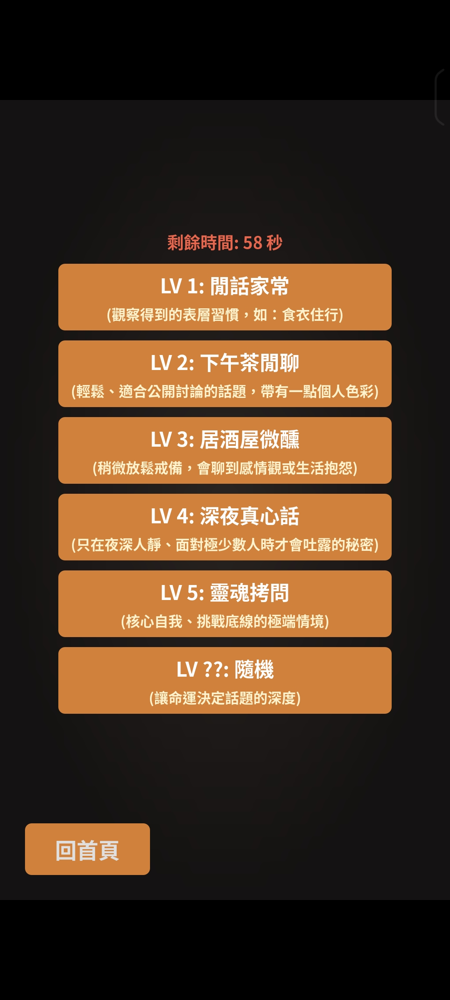
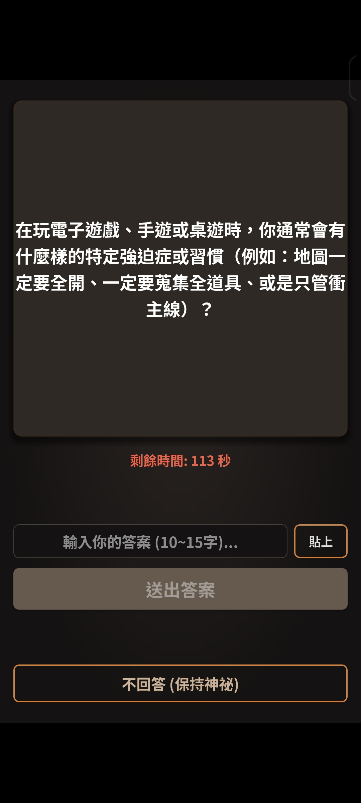
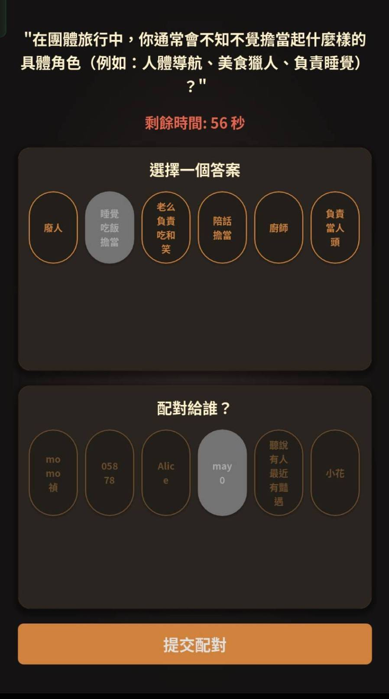
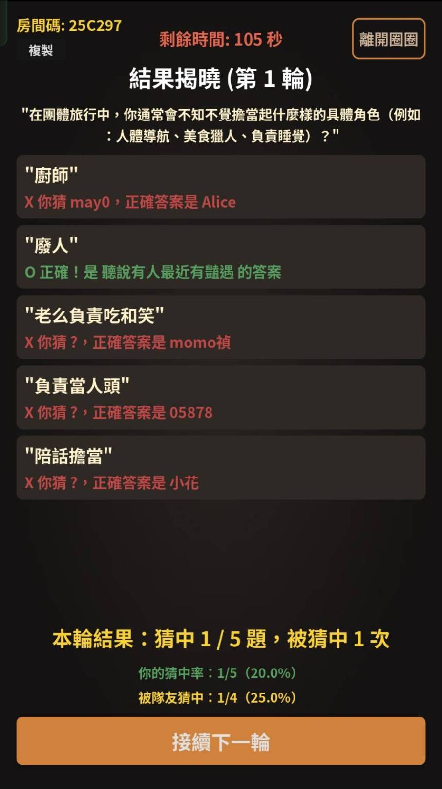
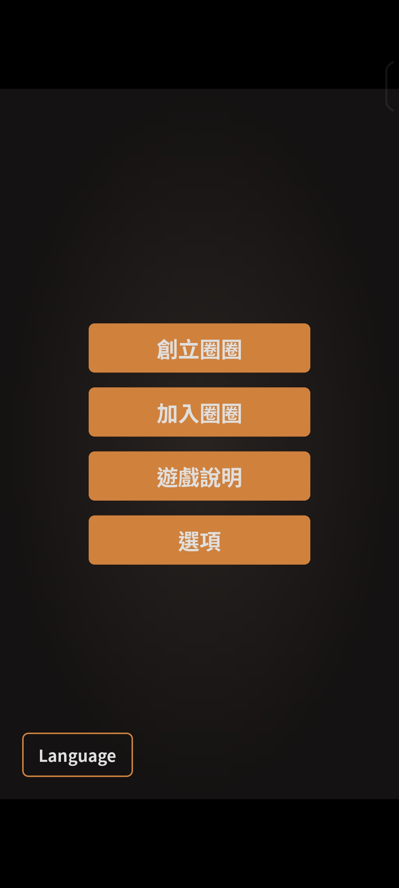
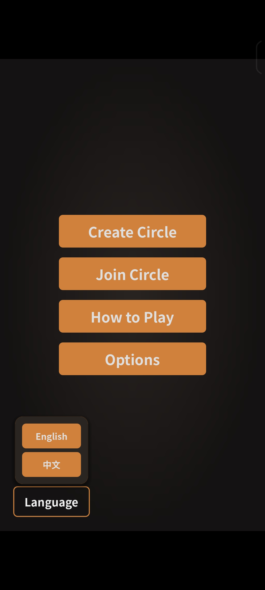
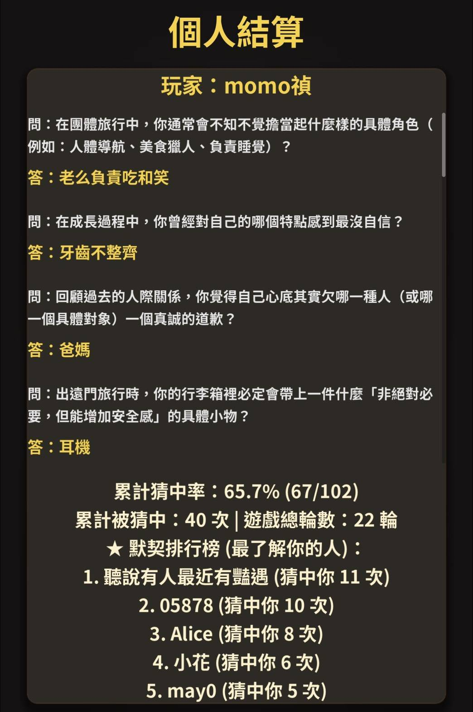

<p align="center">
  
</p>

<h1 align="center">Friends &amp; Me</h1>

<p align="center">
  <b>異步社交探索桌遊</b> ｜ 基於喬哈里視窗理論的多人即時連線遊戲
</p>

<p align="center">
  
  
  
  
  
  
</p>

<p align="center">
  🎮 <a href="https://friendandme.netlify.app"><b>線上試玩（Web）</b></a> ｜ 📖 <a href="PROJECT_SHOWCASE.md"><b>完整專案說明書</b></a> ｜ 💻 <a href="https://github.com/hank92312/Friend-Me"><b>原始碼</b></a>
</p>

---

## 這是什麼？

玩家透過「**答題 → 猜測他人答案 → 結果揭曉**」的循環，核對「他人眼中的自己」與「真實自我」的落差，在低社交壓力下促進朋友間的深度連結。同一份 Godot 程式碼庫同時輸出 **Web** 與 **Android**，後端以權威伺服器架構處理多人即時狀態同步。

## 技術亮點

- **跨平台前端**：Godot 4.6（GDScript），單一程式碼庫匯出 Web（WASM）與 Android（AAB）。
- **權威即時伺服器**：FastAPI + WebSocket，五階段狀態機，所有計分與推進由後端決定（防作弊 / 防 desync）。
- **可靠性設計**：`asyncio` 階段超時自動推進、斷線重連狀態機、伺服器端階段守衛防重複計分。
- **持久化**：SQLAlchemy（async）+ SQLite，部署於 Fly.io Persistent Volume。
- **DevOps 自動化**：自製 Python pipeline 處理 cache-busting、HTTP headers、行動鍵盤補丁、SEO 內容頁。
- **商業整合**：Google AdMob / AdSense / Play Billing 變現。

## 架構一覽

```
┌──────────────┐   REST + WebSocket   ┌─────────────────────────┐
│  Godot 客戶端 │ ───────────────────► │  FastAPI (Fly.io · 東京)  │
│  Web / Android│ ◄─── 狀態廣播 ─────── │  RoomManager + asyncio   │
└──────────────┘                      │  SQLAlchemy → SQLite Vol │
                                      └─────────────────────────┘
```

## 技術棧

| 層級 | 技術 |
|---|---|
| 前端 | Godot 4.6 · GDScript · GL Compatibility（WebGL/GLES）|
| 後端 | Python · FastAPI · WebSockets · uvicorn |
| 資料 | SQLAlchemy（async）· aiosqlite · SQLite |
| 部署 | Docker · Fly.io（Volume）· Netlify · Google Play |
| 變現 | AdMob · AdSense · Google Play Billing |

## 遊戲畫面

核心遊戲循環（Phase 1 → 4）：

| 選題 | 答題 | 配對 | 揭曉 |
|:---:|:---:|:---:|:---:|
|  |  |  |  |

| 主選單 | 多語系切換 | 個人結算（默契排行榜） |
|:---:|:---:|:---:|
|  |  |  |

## 專案結構

```
friendAndme/   Godot 遊戲前端（main.gd, network_manager.gd, 題庫, addons）
backend/       FastAPI 後端（main.py, room_manager.py, models.py, Dockerfile, fly.toml）
build_web_*/   Web 部署產物（WASM/PCK + SEO 頁）
build_and_patch.py   Web 匯出後處理自動化
```

---

<p align="center">
  📖 想了解完整設計、16 項跨平台工程挑戰與面試重點 → <a href="PROJECT_SHOWCASE.md"><b>PROJECT_SHOWCASE.md</b></a>
</p>
